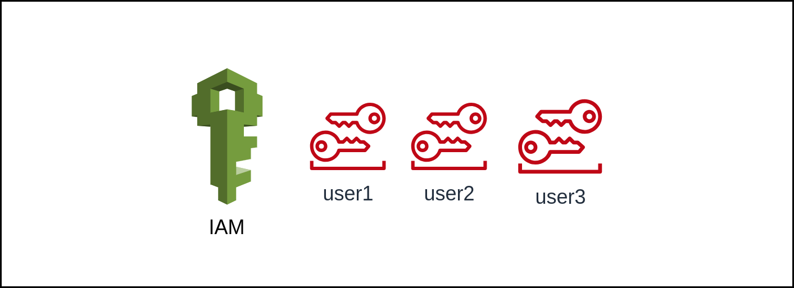
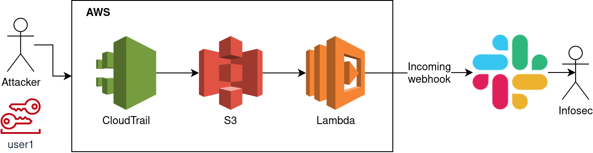

# AWS Honeytokens
This is a POC repository of honeytokens using AWS to monitor the token usage.

Honeytokens are real user tokens without any privileges and with configured logging and reporting on the user activity.
These tokens are placed across the infrastructure to the servers, git projects, each point of the trusted supply chain, etc. 

## Architecture

### Honeytoken creation
The project creates users without any privileges on AWS, to each user, there are created access keys. These keys can be distributed across the infrastructure.
The users are configured with the specific `user_prefix`, which recognises the honeytoken from the user ARN. 
The users path should be specified only for the honeytokens. If there are other users using the honeytoken user path, it can cause false positive reports.
<b> Warning the attackers can see the user path and the user name </b> for this there are added user tags.
The users can be configured with specific tags describing more details about the honeytoken, like his placement in Netwrok.
The attacker can only see the user ARN with the name, so they can not see these tags.


### Monitoring of the honeytokens
To monitor the usage of the honeytokens, this design uses AWS CloudTrail, which can log management events.
These logs are stored in an S3 bucket configured with the Lambda function with a trigger whenever data is added to the bucket.
Once the Lambda function is triggered, it checks if the added data from the CloudTrail matches the format of the honeytoken user.
If they match the format, Lambda requests tags from the triggered honeytoken user and sends information to the Slack incoming webhook. 


## Configuration
To configure this project you can use the `terraform.tfvars`.
The variable file contains the users with their names and the `user_prefix`.
<b>Warning the user names and user paths are visible to the attacker.</b>
Each has tags which can give more information to the administrator about the location
of the triggered token.
```
users = {
  admin-user1 = {
    server = "192.168.2.23"
  }
  admin-user2 = {}
}

user_prefix="infra"

# Slack config
webhook_url = "https://hooks.slack.com/TXXXXX/BXXXXX/XXXXXXXXXX"
```
## Deployment

```bash
# Inicilize the Terraform project
$ terraform init
# Edit the 
$ terraform apply
$ terraform output -json honeytokens_access_keys | jq
```
