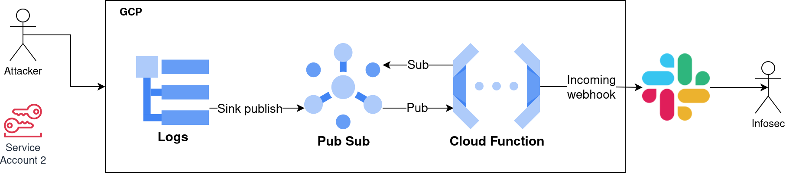

# GCP Honeytokens

This is a POC repository of honeytokens using GCP to monitor the token usage.

Honeytokens are real user tokens without any privileges and with configured logging and reporting on the user activity.
These tokens are placed across the infrastructure to the servers, git projects, each point of the trusted supply chain, etc. 

## Architecture

### Honeytoken creation
The project creates service account without any privileges on GCP, to each service account, there are created access keys. These keys can be distributed across the infrastructure.
The service accounts are configured with the specific `user_prefix`, which recognises the honeytoken from the service accounts email address. 
The service accounts path should be specified only for the honeytokens. If there are other users using the honeytoken service accounts path, it can cause false positive reports.
<b> Warning the attackers can see the user path and the user name </b> for this there are added user tags.
The users can be configured with specific tags describing more details about the honeytoken, like his placement in Netwrok.


### Monitoring of the honeytokens
To monitor the usage of the honeytokens, this design uses the GCP logging sink, which monitor the created logs and create pub events for the Pub Sub. To this Pub Sub is subscribed a lambda function of 2nd generation. The logging sink filters the events by the service accont prefix by the project id.



## Configuration
To configure this project you can use the `terraform.tfvars`.
The variable file contains the users with their names and the `user_prefix`.
<b>Warning the user names and user paths are visible to the attacker.</b>
Each has tags which can give more information to the administrator about the location
of the triggered token.

```
users = {
  admin-user1 = {
    # WARNING only 256 char possible labels in TOTAL
    server = "192.168.2.23"
  }
  admin-user2 = {}
}

user_prefix="infra"

# Slack config
webhook_url = "https://hooks.slack.com/TXXXXX/BXXXXX/XXXXXXXXXX"
```

## Deployment

```bash
# Inicilize the Terraform project
$ terraform init
# Edit the 
$ terraform apply
$ terraform output -json honeytokens_access_keys | jq
```